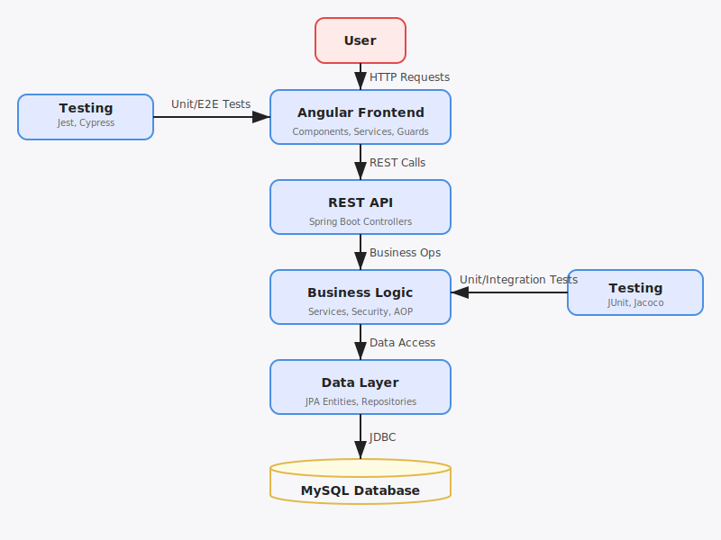
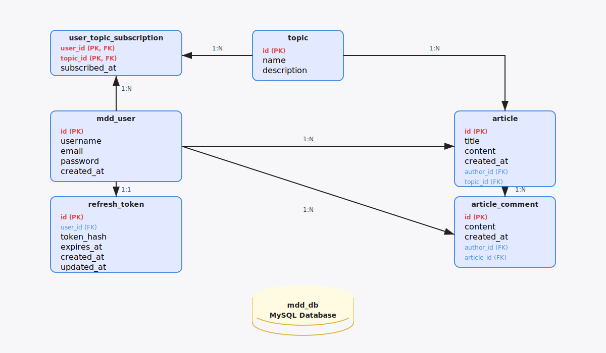
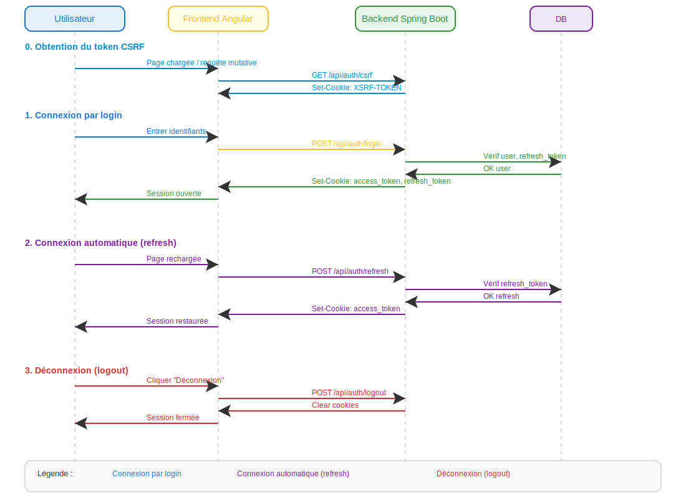

# Application Full-Stack MDD-API

Projet OpenClassrooms : API et Frontend pour un réseau social de développeurs.  Option B

## Structure du projet

- `back/` : API Java Spring Boot (`back/src/main/java`, `back/src/main/resources`, tests, `back/pom.xml`)
- `front/` : Application Angular (`front/src/`, tests, configuration, `front/package.json`)
- `specs/` : Spécifications fonctionnelles et techniques (PDF/Markdown)
- `postman/` : Collection Postman pour tester l’API

### Annexes visuelles (SVG)

Ces diagrammes sont inclus dans ce README pour faciliter la lecture :

- Architecture globale : [specs/architecture-global.svg](specs/architecture-global.svg)
- Modèle de données (ERD) : [specs/model.db.svg](specs/model.db.svg)
- Sécurité (séquence) : [specs/security-session-sequence.svg](specs/security-session-sequence.svg)

## Architecture globale de l’application

Ce schéma donne une vue d’ensemble des interactions entre l’utilisateur, le frontend Angular, le backend Spring Boot et la base de données :

<p>
  
</p>

## Modèle de données

Le schéma suivant présente la structure du modèle de données relationnel utilisé par l’application (tables, relations, clés primaires/étrangères) :

<p>
  
</p>

## Sécurité : séquence d’authentification/session

Le diagramme ci-dessous détaille les étapes de gestion de session et d’authentification, incluant la protection CSRF, le login, le refresh automatique et le logout :

<p>
  
</p>


### Explication détaillée de chaque étape et justification des choix pour la production


**0. Obtention du token CSRF**

*Définition :*
Le CSRF (Cross-Site Request Forgery, ou falsification de requête inter-sites) est une attaque où un site malveillant amène un utilisateur authentifié à exécuter à son insu des actions sur une application où il est connecté. Cela permettrait, par exemple, de modifier des données ou d’effectuer des transactions sans le consentement de l’utilisateur.

*But :* Empêcher les attaques CSRF sur toutes les requêtes mutatives (POST, PUT, DELETE).

*Pourquoi ce choix :*
  - Le backend génère un token CSRF unique par session et le transmet via un cookie sécurisé (HttpOnly=false, SameSite=Strict).
  - Le frontend doit systématiquement inclure ce token dans l’en-tête de chaque requête mutative.
  - Cette protection est indispensable en production pour toute API exposée à un navigateur.

**1. Connexion par login**

*But :* Authentifier l’utilisateur et initialiser la session.

*Pourquoi ce choix :* 
  - Les identifiants sont transmis via HTTPS, le backend vérifie l’utilisateur et génère deux tokens : access_token (court) et refresh_token (long).
  - Les tokens sont stockés en cookies sécurisés (HttpOnly, SameSite=Strict) pour éviter le vol par XSS.
  - Cette méthode est la plus robuste pour la production, car elle limite l’exposition des tokens côté client.

**2. Connexion automatique (refresh)**

*But :* Permettre à l’utilisateur de rester connecté sans ressaisir ses identifiants, tout en gardant un haut niveau de sécurité.

*Pourquoi ce choix :* 
  - À chaque rechargement de page, le frontend tente d’obtenir un nouvel access_token via le refresh_token.
  - Le refresh_token n’est jamais transmis au frontend, il reste en cookie HttpOnly.
  - Si le refresh échoue, l’utilisateur est déconnecté (sécurité renforcée).
  - Ce mécanisme est recommandé en production pour l’UX et la sécurité.

**3. Déconnexion (logout)**

*But :* Invalider la session et supprimer tous les tokens côté client et serveur.

*Pourquoi ce choix :* 
  - Le backend supprime les cookies (access_token, refresh_token) et invalide le refresh côté serveur.
  - Cela garantit qu’aucun token ne subsiste après la déconnexion, même en cas de vol de cookie.
  - Cette étape est essentielle pour la conformité RGPD et la sécurité en production.


## Prérequis

- Java 21+
- Node.js 18+
- MySQL 8+

## Installation et configuration

1. **Base de données** :
   - **Définissez d'abord les variables d’environnement** à utiliser dans le script SQL et dans la configuration Spring Boot :
     - `DB_USER` : le nom d'utilisateur MySQL (ex : kevin)
     - `DB_PASSWORD` : le mot de passe MySQL choisi (ex : votre_mot_de_passe)
     - `DB_MDD_NAME` : le nom de la base de données (ex : mdd_db)
     - `JWT_SECRET` : clé de signature JWT (secret backend, **non commité**)
     - Sous Windows :
       - Session courante : `set DB_USER="kevin"` etc.
       - Persistant : `setx DB_USER "kevin"` etc.
     - **Important :** Ces variables doivent être accessibles à Spring Boot (soit dans l'environnement système, soit dans `back/src/main/resources/application.properties` via `${DB_USER}` etc.).
   - **Adaptez le script** `back/src/main/resources/base.sql` en remplaçant les valeurs par vos variables/envies :
     ```sql
     CREATE DATABASE mdd_db CHARACTER SET utf8mb4 COLLATE utf8mb4_unicode_ci;
     CREATE USER 'kevin'@'localhost' IDENTIFIED BY 'votre_mot_de_passe';
     GRANT SELECT, INSERT, UPDATE, DELETE, ALTER, CREATE, DROP, REFERENCES ON mdd_db.* TO 'kevin'@'localhost';
     FLUSH PRIVILEGES;
     ```
   - **Exécutez ensuite ce script** dans MySQL pour créer la base et l’utilisateur avec les droits nécessaires.

2. **JWT_SECRET (obligatoire)** :

Le backend lit la clé via la variable d’environnement `JWT_SECRET` (aucune valeur en dur n’est committée).

- **Windows (PowerShell) — générer un secret fort (32 octets) et le définir pour la session courante :**
  - Génération :
    ```powershell
    $bytes = New-Object byte[] 32
    [System.Security.Cryptography.RandomNumberGenerator]::Create().GetBytes($bytes)
    $secret = [Convert]::ToBase64String($bytes)
    $env:JWT_SECRET = $secret
    $env:JWT_SECRET
    ```
  - (Optionnel) Rendre la variable persistante :
    ```powershell
    setx JWT_SECRET "$env:JWT_SECRET"
    ```

  > Important : `setx` n’actualise pas les variables d’environnement dans les terminaux déjà ouverts.
  > Après `setx`, ouvrez un **nouveau terminal** (et si besoin redémarrez VS Code) avant de relancer Maven.
  > Alternative sans redémarrer VS Code : rechargez la valeur persistée dans la session courante avec :
  > ```powershell
  > $env:JWT_SECRET = [Environment]::GetEnvironmentVariable("JWT_SECRET","User")
  > ```

- **Linux/Mac — générer et exporter :**
  ```bash
  export JWT_SECRET="$(openssl rand -base64 32)"
  ```

> Note : changer `JWT_SECRET` invalide les tokens existants, ce qui est normal.

### Variables d’environnement Spring et valeurs par défaut

Dans `back/src/main/resources/application.properties`, certaines valeurs utilisent la syntaxe Spring `${NOM_DE_VAR:valeur_par_defaut}`.

- Si la variable d’environnement `NOM_DE_VAR` est définie, Spring l’utilise.
- Sinon, Spring utilise la `valeur_par_defaut`.

Exemples utilisés par l’API :

- `JWT_EXPIRATION_SECONDS` (défaut `900`) : durée de vie de l’access token.
- `JWT_REFRESH_EXPIRATION_SECONDS` (défaut `2592000`) : durée de vie du refresh token.
- `JWT_REFRESH_COOKIE_NAME` (défaut `refresh_token`) : nom du cookie refresh.
- `JWT_COOKIE_NAME` (défaut `access_token`) : nom du cookie access.
- `JWT_COOKIE_SECURE` (défaut `false`) : cookie uniquement en HTTPS si `true`.
- `JWT_COOKIE_SAMESITE` (défaut `Lax`) : politique SameSite.

> `JWT_SECRET` est volontairement **sans valeur par défaut** et doit être fourni.

3. **Backend** :
   - Placez-vous dans `back/`.
  - Lancez `./mvnw.cmd clean package` (Windows) ou `./mvnw clean package` (Linux/Mac).
  - Fichier de config : `back/src/main/resources/application.properties`.

4. **Frontend** :
   - Placez-vous dans `front/`.
  - Lancez `npm install` puis `npm run start` (équivalent à `ng serve`).

## Gestion de l'environnement Spring Boot

Le profil actif de l'application backend est défini par la propriété `spring.profiles.active`.

- Par défaut, la valeur est `dev` (voir `back/src/main/resources/application.properties`).
- Vous pouvez la surcharger via une variable d'environnement, un argument JVM ou un autre fichier de configuration.
- Exemple : pour lancer en mode production :
  - Windows (PowerShell) : `$env:SPRING_PROFILES_ACTIVE="prod"` puis `./mvnw.cmd spring-boot:run`
  - Linux/Mac : `SPRING_PROFILES_ACTIVE=prod ./mvnw spring-boot:run`

Si aucune valeur n'est définie, le profil `dev` sera utilisé par défaut.

## Lancement

- **Backend** :
	- `cd back`
  - Windows : `./mvnw.cmd spring-boot:run`
  - Linux/Mac : `./mvnw spring-boot:run`
	- L’API écoute sur `http://localhost:8080/api`
- **Frontend** :
	- `cd front`
  - `npm run start` (équivalent à `ng serve`) (http://localhost:4200)

## Tester le front Angular minifié en local (production) avec Lighthouse

> **Optionnel :** Cette étape est recommandée pour l’audit de performance et d’accessibilité, mais n’est pas obligatoire pour le fonctionnement de l’application.

### Prérequis (à faire une seule fois)

1. **Installer les dépendances nécessaires pour le serveur Express :**
   - Placez-vous dans `front/`.
   - Installez :
     ```
     npm install express http-proxy-middleware
     ```
   - Vérifiez que le fichier `server.js` existe (voir exemple plus bas).

### Étapes à exécuter à chaque test

1. **Build production Angular**
   - Placez-vous dans `front/`.
   - Lancez :
     ```
     ng build --configuration production
     ```
   - Le front minifié sera généré dans `front/dist/front/browser`.
   - ⚠️ À chaque modification du front (HTML, CSS, Angular), il faut relancer cette commande pour mettre à jour la version minifiée.

2. **Lancer le backend Spring Boot**
   - Placez-vous dans `back/`.
   - Lancez :
     ```
     ./mvnw.cmd spring-boot:run
     ```
   - Le backend écoute sur le port 8080.

3. **Lancer le serveur Express avec proxy**
   - Placez-vous dans `front/`.
   - Lancez :
     ```
     node server.js
     ```
   - Le front sera accessible sur http://localhost:8081/
   - Toutes les requêtes `/api` seront automatiquement proxy vers le backend sur 8080.

4. **Tester avec Lighthouse**
   - Ouvrez http://localhost:8081/user/login ou une page publique (c’est-à-dire accessible sans connexion, par exemple : page d’accueil, inscription, mentions légales, etc.).
   - Lancez Lighthouse depuis Chrome DevTools.
   - **Pour un audit pertinent, il est recommandé de tester chaque page de l’application (publique et privée). Seul un audit complet de toutes les pages a une réelle valeur.**
   - Vous obtiendrez le score réel de la version minifiée, avec backend accessible.

Exemple de fichier `server.js` :
```js
const express = require('express');
const { createProxyMiddleware } = require('http-proxy-middleware');
const path = require('path');

const app = express();
// Proxy /api vers le backend
app.use('/api', createProxyMiddleware({ target: 'http://localhost:8080', changeOrigin: true }));
// Servir les fichiers statiques Angular
app.use(express.static(path.join(__dirname, 'dist/front/browser')));
// Fallback Angular pour toutes les routes
app.get('*', (req, res) => {
  res.sendFile(path.join(__dirname, 'dist/front/browser/index.html'));
});
const PORT = 8081;
app.listen(PORT, () => {
  console.log(`Front prod avec proxy sur http://localhost:${PORT}`);
});
```

## Sécurité et persistance de session (Frontend)

- **Modes d’environnement Angular :**
	- **Production (`environment.prod.ts`)** : `production: true`, `useMock: false`, `enableDevRoutes: false`
		- Session via cookies HttpOnly sécurisés (aucune donnée de session côté JS).
	- **Développement/mock (`environment.dev.ts`)** : `production: false`, `useMock: true`, `enableDevRoutes: true`
		- Session stockée dans `localStorage` (pour tests locaux uniquement).
	- **Normal/intermédiaire (`environment.ts`)** : `production: false`, `useMock: false`, `enableDevRoutes: false`
		- Mocks et routes de dev désactivés, mais pas d’optimisation prod : la session fonctionne comme en prod (cookies HttpOnly, aucune persistance locale JS).
		- Sert pour des builds intermédiaires ou des tests manuels sans mocks.

- **Résumé :**
	- `useMock: true` → localStorage (mock/dev uniquement)
	- `useMock: false` → cookies HttpOnly (normal & prod)
	- Le mode "normal" est sécurisé comme la prod, sans mocks ni persistance locale.

- **Aucun risque de fuite de données de test/mock ou de persistance locale en production** : la configuration et le code garantissent l’isolation stricte.

Pour plus de détails, voir : `front/src/environments/`, `front/src/app/core/providers/data-sources.providers.ts`, `front/src/app/core/auth/auth.service.ts`, `front/src/app/core/auth/auth-mock.service.ts`.

---

## Tests et couverture

- **Backend** :
  - Windows : `./mvnw.cmd test` (generates reports in `target/`)
  - Linux/Mac : `./mvnw test` (generates reports in `target/`)
  - Jacoco coverage: 70% threshold per package (see `back/pom.xml` and `rules.md`)
- **Frontend** :
	- `npm run test:unit:ci` (Jest, unit tests + coverage)
  - `npm run e2e:run:coverage` (Cypress, end-to-end tests + coverage)
	- **Attention : le backend doit être lancé avant d’exécuter les tests e2e.**

Optionnel (travail ciblé, sans couverture) :
- `npm run e2e:ci -- --spec cypress/e2e/full_flow.cy.ts`
  - Lance uniquement Cypress (le frontend doit déjà tourner).
  - Pratique pour exécuter un test spécifique pendant un correctif frontend.

Optionnel (global, sans couverture) :
- `npm run e2e:ci`
  - Lance tous les tests Cypress en headless (le frontend doit déjà tourner).

> ⚠️ For frontend **tests + coverage reports**, the supported commands are `npm run test:unit:ci` and `npm run e2e:run:coverage`. Do not use `ng test` or `npm run test:e2e`.

## Notes

- Les entités JPA sont exclues de la couverture de code.
- Les variables sensibles (secrets JWT, accès DB) doivent être passées en variables d’environnement.
- Pour toute question sur les exigences, consulter `specs/`.

## FAQ utilisateur

La FAQ orientée “utilisation” (non technique) et l’espace pour les captures d’écran sont dans : `docs/FAQ-Utilisateurs.md`.


## FAQ – Problèmes fréquents

### "ng test" ne fonctionne pas / Erreur Jest builder

**Erreur courante :**
> Error: Could not find the '@angular-builders/jest:run' builder's node package.

**Solution :**
- Vérifiez que vous avez bien installé les dépendances : `npm install` dans le dossier `front/`.
- Si le problème persiste, installez le builder manquant : `npm install --save-dev @angular-builders/jest`
- Vous pouvez aussi lancer les tests unitaires directement avec Jest : `npm run test:unit` ou `npm run test:unit:ci`

### "ng" ou "npm" non reconnu

**Solution :**
- Vérifiez que Node.js et Angular CLI sont bien installés et présents dans votre PATH.
- Relancez votre terminal après installation.

### Problème de port déjà utilisé (frontend)

**Erreur courante :**
> Error: listen EADDRINUSE: address already in use 4200

**Solution :**
- Fermez l’application déjà en cours sur ce port ou lancez le front sur un autre port : `npm run start -- --port=4201` (équivalent à `ng serve --port 4201`)

### Problème de connexion à la base de données

**Solution :**
- Vérifiez les variables d’environnement (`DB_USER`, `DB_PASSWORD`, `DB_MDD_NAME`).
- Vérifiez que MySQL est bien démarré et accessible.

### Les tests Cypress échouent en CI

**Solution :**
- Vérifiez que le backend est bien lancé avant les tests e2e.
- Vérifiez la configuration du proxy (`front/proxy.conf.json`).
- Nettoyez les artefacts Cypress si besoin (`front/cypress/screenshots`, `front/cypress/videos`).

### Autres conseils
- Toujours relire les logs d’erreur pour repérer le vrai message bloquant.
- En cas de doute, supprimez `front/node_modules` et refaites `npm install`.
- Consultez `rules.md` pour les conventions et seuils qualité.

## Documentation et références

- `docs/FAQ-Utilisateurs.md` : FAQ utilisateur + espace captures d’écran (images à déposer dans `docs/screenshots/`)
- `docs/dictionnaire-donnees.md` : dictionnaire de données (champs, contraintes, validations, mapping DTO ↔ tables)
- `docs/api-et-schemas.md` : endpoints API + exemples JSON + diagramme des relations (SVG)
- `docs/analyse-besoins-frontend.md` : synthèse besoins → écrans → composants → endpoints API
- `specs/` : spécifications fonctionnelles et techniques
- `postman/` : collection Postman pour l’API

