# FAQ utilisateur — Utilisation de l’application

Ce document regroupe :

1) Une FAQ orientée “utilisation” (non technique)
2) Un espace dédié aux captures d’écran à fournir dans le livrable

## Comment s’inscrire (créer un compte) ?

1. Depuis la page d’accueil, cliquez sur **S’inscrire**.
2. Renseignez **Nom d’utilisateur**, **Adresse e-mail** et **Mot de passe**.
3. Cliquez sur **S’inscrire**.

Après validation, vous êtes redirigé vers le fil **Articles**.

## Comment se connecter ?

1. Depuis la page d’accueil, cliquez sur **Se connecter**.
2. Renseignez votre **e-mail ou nom d’utilisateur**, puis votre **mot de passe**.
3. Validez.

## Où est le fil (liste des articles) ?

- Le fil est accessible via le bouton **Articles** dans l’en-tête.
- Si vous n’êtes pas connecté, l’application vous redirige vers la page d’accueil.

## Comment trier les articles ?

Sur la page **Articles**, utilisez la zone **Trier** (flèche ↑/↓) pour inverser l’ordre d’affichage (du plus récent au plus ancien, ou l’inverse).

## Comment s’abonner à un thème ?

1. Allez dans **Thèmes**.
2. Sur un thème, cliquez sur **s’abonner**.

Le bouton passe à **se désabonner** quand l’abonnement est actif.

## Où voir (et gérer) mes abonnements ?

- Allez dans **Profil**.
- La liste de vos thèmes abonnés s’affiche, avec un bouton **se désabonner** pour chacun.

## Comment mettre à jour mon profil ?

1. Allez dans **Profil**.
2. Modifiez les champs souhaités.
3. Cliquez sur **Sauvegarder**.

## Comment créer un article ?

1. Allez dans **Articles**.
2. Cliquez sur **Créer un article**.
3. Remplissez le formulaire, puis cliquez sur **Créer**.

## Comment commenter un article ?

1. Allez dans **Articles**.
2. Ouvrez un article en cliquant sur sa carte.
3. Dans la section **Commentaires**, saisissez votre message et cliquez sur **Sauvegarder**.

## Comment se déconnecter ?

- Cliquez sur **Se déconnecter** dans l’en-tête.

## Que se passe-t-il si ma session expire ?

- La session est dite “persistante” car l’application tente de vous reconnecter automatiquement via un **refresh token** stocké en cookie.
- Elle peut néanmoins expirer ou devenir invalide (durée de vie du refresh token, déconnexion, cookies supprimés, changement de secret côté serveur, etc.).
- Dans ce cas, l’application vous redirige vers la page d’accueil et il faudra vous reconnecter pour accéder aux pages protégées (**Articles**, **Thèmes**, **Profil**).

# Captures d’écran — espace livrable

Les images sont à déposer dans `docs/screenshots/` (sans sous-dossier).

Objectif : garder une taille d’affichage identique par catégorie lors de la lecture sur GitHub.
- Desktop : largeur fixe `900`.
- Mobile : largeur fixe `360`.

## Liste des captures

| Écran | Objectif | Fichier (desktop) | Fichier (mobile) |
|---|---|---|---|
| Accueil | Page d’accueil avant connexion | `docs/screenshots/accueil.png` | `docs/screenshots/accueil-mobile.png` |
| Inscription | Formulaire + validation OK | `docs/screenshots/inscription.png` | `docs/screenshots/inscription-mobile.png` |
| Connexion | Formulaire de connexion | `docs/screenshots/connexion.png` | `docs/screenshots/connexion-mobile.png` |
| Articles | Fil d’articles (après connexion) | `docs/screenshots/articles.png` | `docs/screenshots/articles-mobile.png` |
| Thèmes | Liste des thèmes | `docs/screenshots/themes.png` | `docs/screenshots/themes-mobile.png` |
| Profil | Page profil (avant/après modification) | `docs/screenshots/profil.png` | `docs/screenshots/profil-mobile.png` |
| Créer un article | Formulaire de création | `docs/screenshots/creer-article.png` | `docs/screenshots/creer-article-mobile.png` |
| Détails article | Page détail + commentaires | `docs/screenshots/article-details.png` | `docs/screenshots/article-details-mobile.png` |

## Galerie desktop (liens)

**Accueil (desktop)**

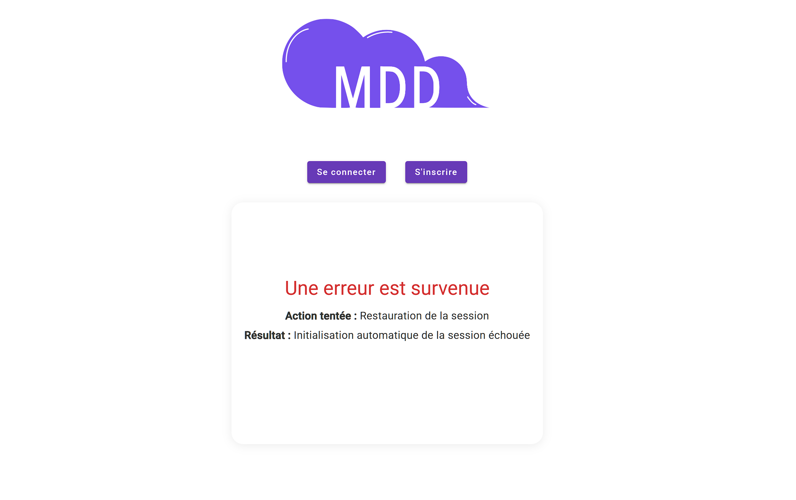

**Inscription (desktop)**

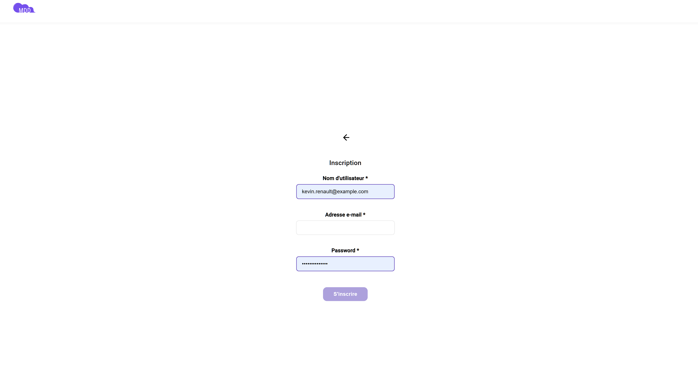

**Connexion (desktop)**

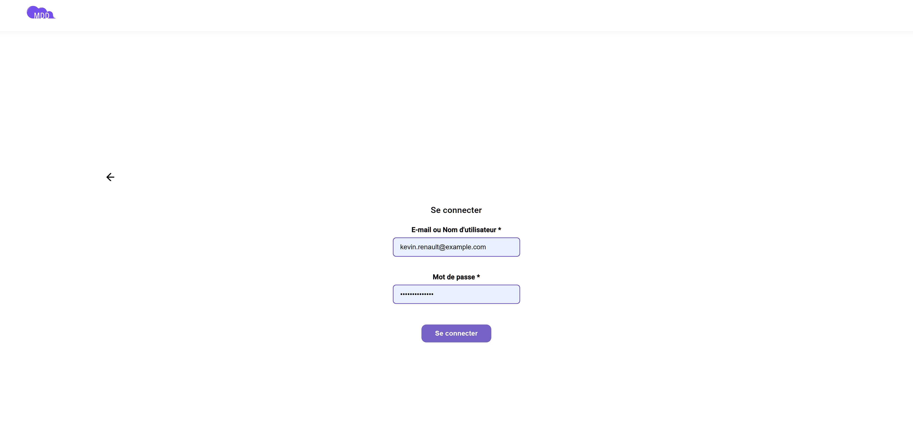

**Articles (desktop)**

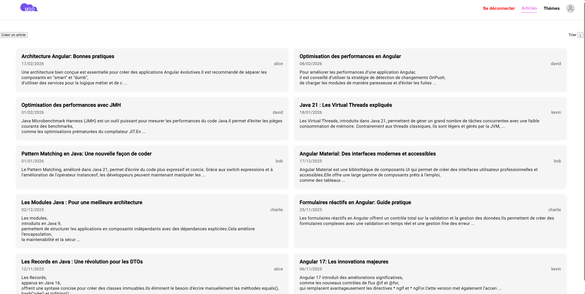

**Thèmes (desktop)**

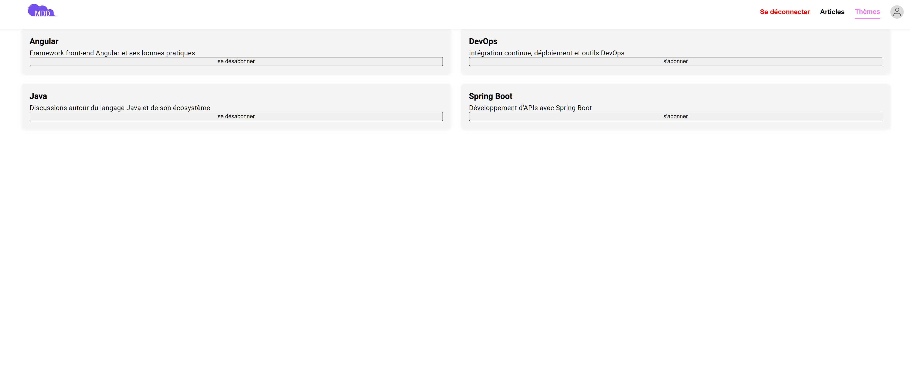

**Profil (desktop)**

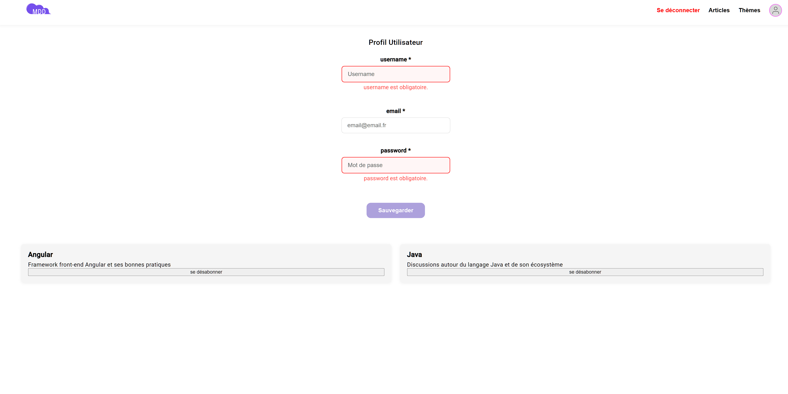

**Créer un article (desktop)**

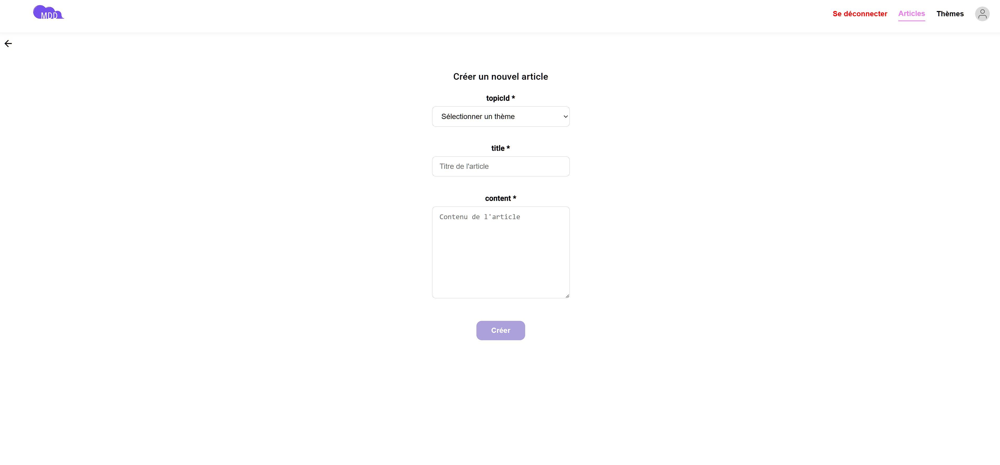

**Détails article (desktop)**

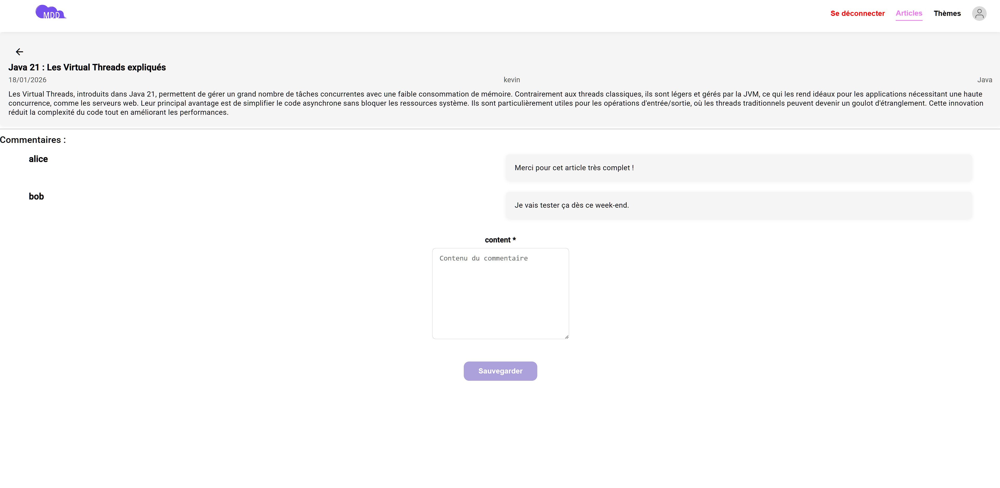

## Galerie mobile (liens)

**Accueil (mobile)**

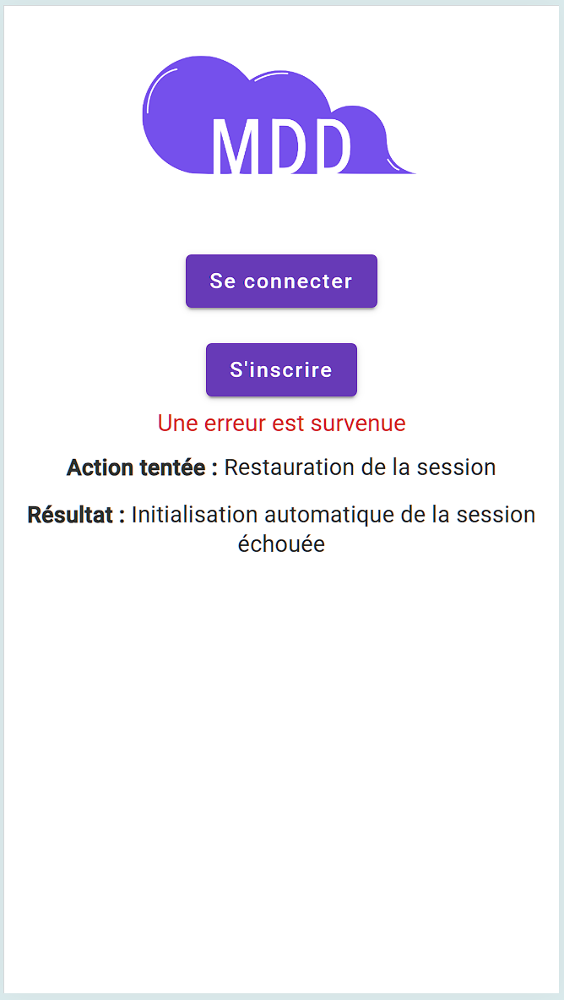

**Inscription (mobile)**

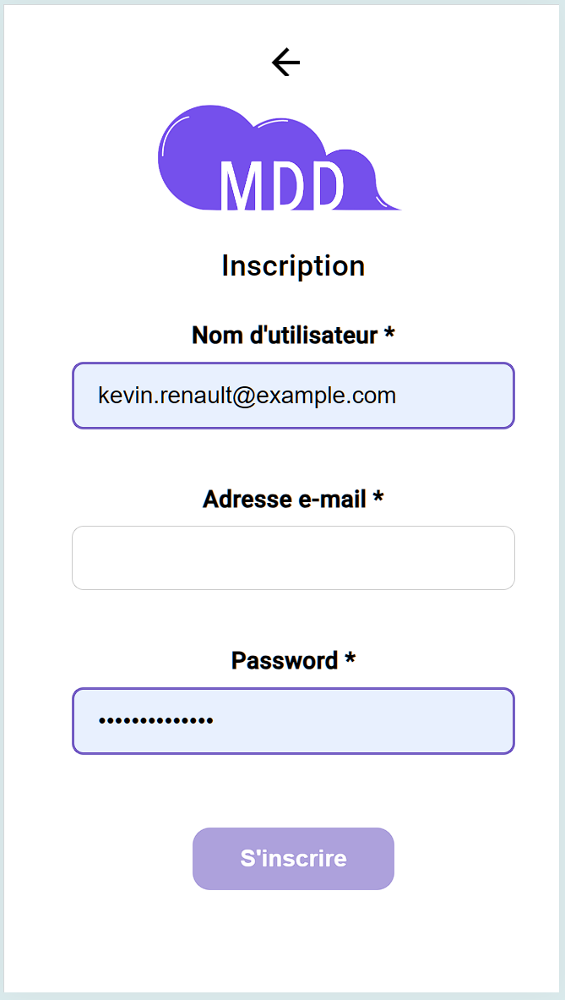

**Connexion (mobile)**

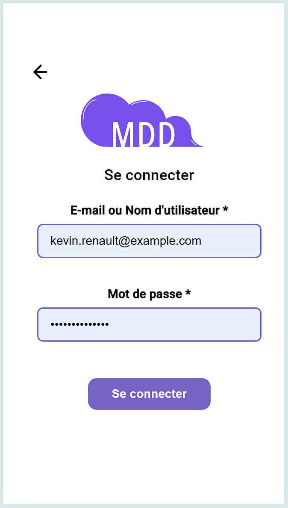

**Articles (mobile)**

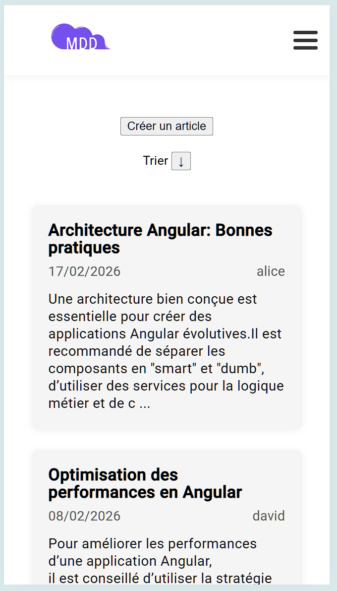

**Thèmes (mobile)**

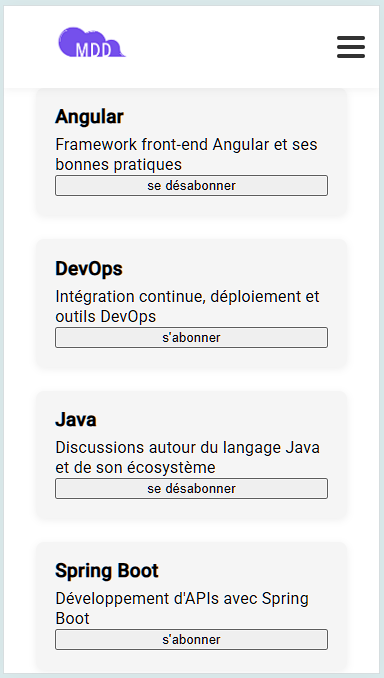

**Profil (mobile)**

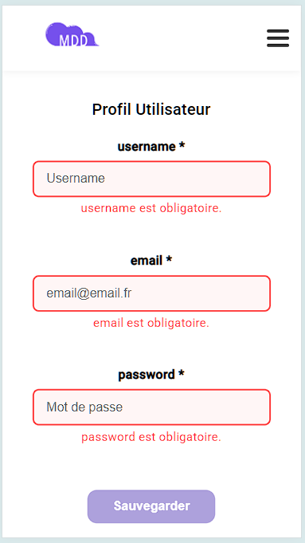

**Créer un article (mobile)**

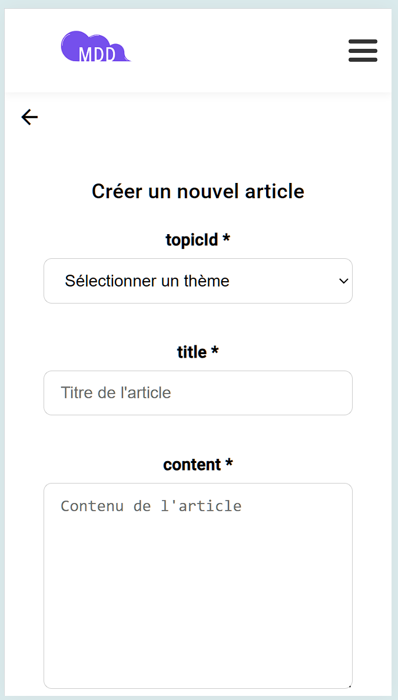

**Détails article (mobile)**

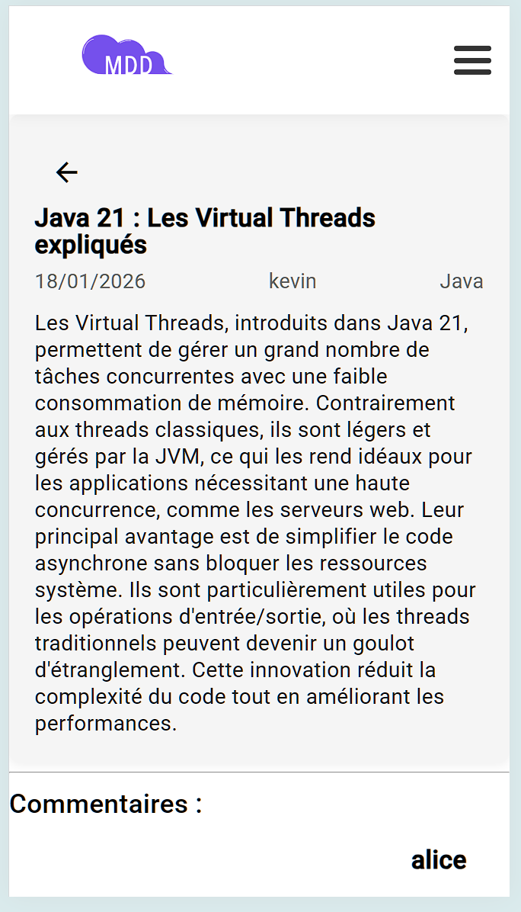